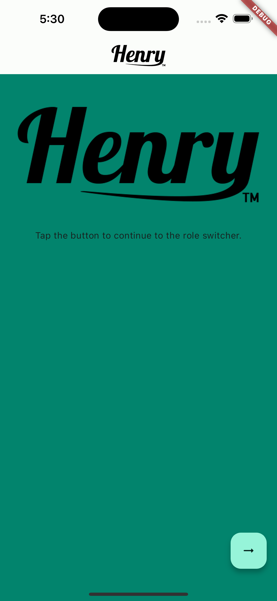
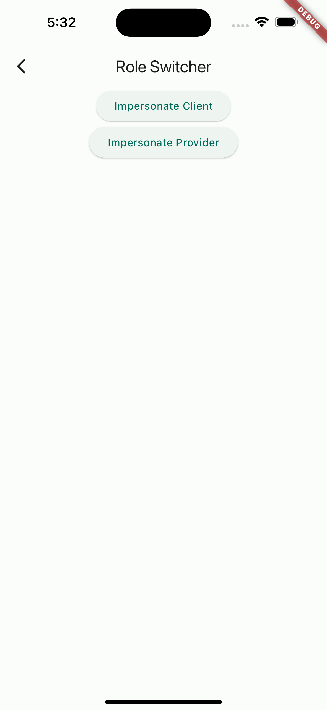
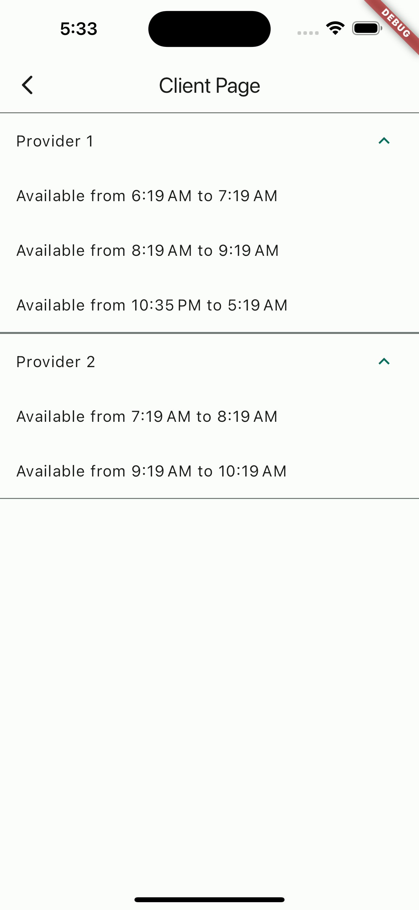
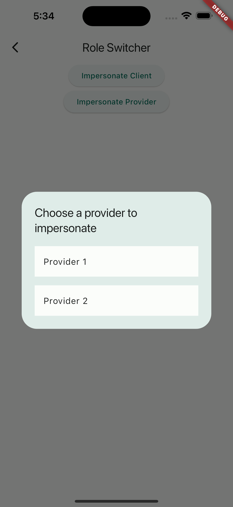
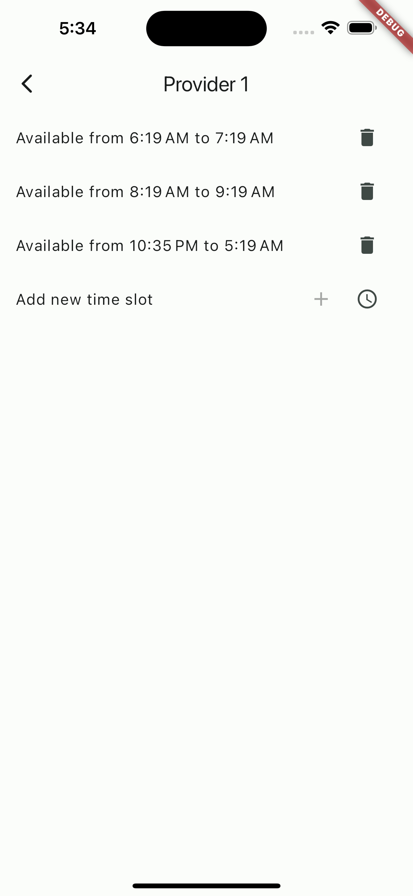
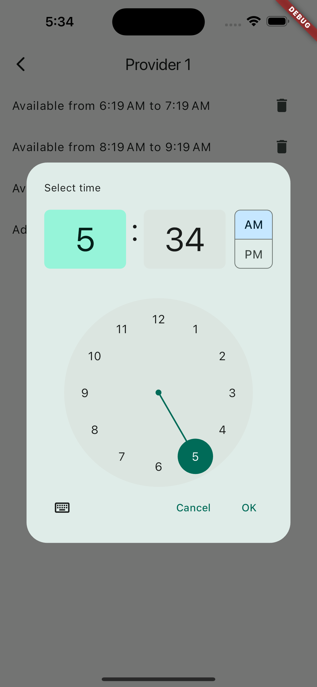
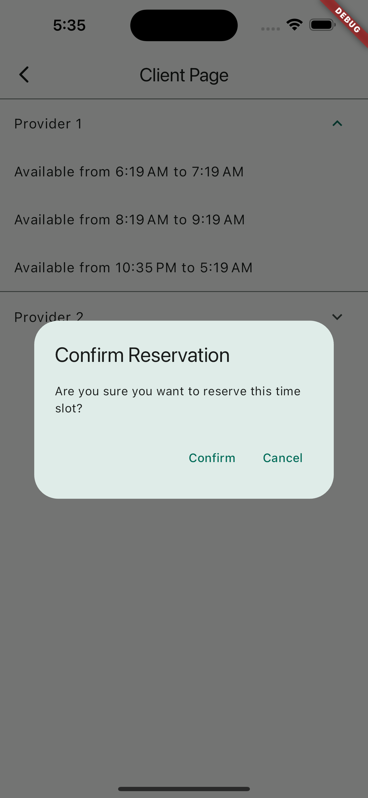
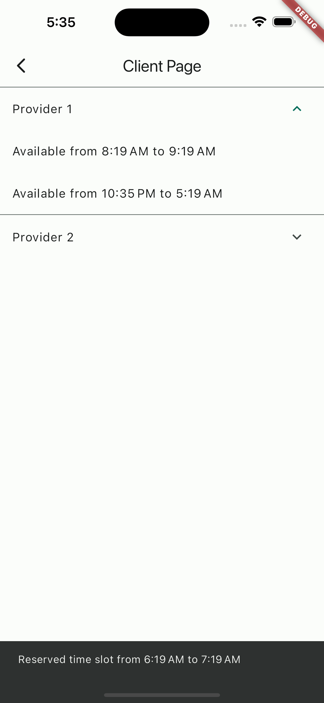

# Reservation App

For review by Henry Meds.

## Description

This is a simple Flutter application that manages and displays available time slots for various service providers. It allows users to view the schedules of different providers and book available time slots. The application uses a Provider-based state management approach, ensuring efficient and reactive updates to the user interface.

## How it Works

The application is built using Flutter, a popular open-source UI software development kit from Google. It uses Dart as the programming language.

### Provider-Based State Management

The application uses the Provider package for state management. This package allows efficient propagation of changes across the widget tree, ensuring that only widgets that depend on a particular piece of state are rebuilt when that state changes.

In this application, each service provider has a schedule, represented as a list of `TimeSlot` objects. Each `TimeSlot` has a start and end time. The `ProviderModel` class encapsulates the data and operations for a service provider.

The `MasterSchedule` class is a `ChangeNotifier`, which means it can notify listeners when its state changes. It holds the schedule for all providers. When a time slot is booked, it updates its state and notifies any listening widgets to rebuild.

### User Interface

The `ProviderPage` widget displays the available time slots for a given provider. It listens to changes in the `MasterSchedule` and rebuilds whenever the schedule changes.

When the `ProviderPage` is first built, it registers itself as a listener of the `MasterSchedule`. Then, it builds a list of widgets representing the available time slots. Each time slot is displayed as a text widget showing the start and end times.

When a user books a time slot, the `ProviderPage` calls a method on the `MasterSchedule` to update the schedule. Because the `MasterSchedule` is a `ChangeNotifier`, this triggers a rebuild of the `ProviderPage`, and the updated schedule is displayed.

### Testing

The application includes unit tests to verify that the `ProviderPage` correctly displays the available time slots and updates when a time slot is booked. The tests use the `testWidgets` function from the `flutter_test` package to create a test environment, build the `ProviderPage` widget, and then check that the expected widgets are present.

## Getting Started with the Application

This section provides instructions on how to clone the repository and run the application on your local machine.

### Prerequisites

Before you begin, ensure you have met the following requirements:
1. You have installed [Git](https://git-scm.com/downloads).
2. You have installed [Flutter](https://flutter.dev/docs/get-started/install).
3. You have a text editor like [VS Code](https://code.visualstudio.com/download) or [Android Studio](https://developer.android.com/studio).

### Cloning the Repository

To clone the repository, follow these steps:

1. Open your terminal.
2. Change the current working directory to the location where you want the cloned directory.
3. Type `git clone`, and then paste the URL of the repository.
4. Press Enter to create the local clone.

### Running the Application

To run the application, follow these steps:

1. Open the cloned directory in your text editor.
2. Open a terminal in the project directory.
3. Run the command `flutter pub get` to install the dependencies.
4. Run the command `flutter run` to start the application.
5. The application should launch on an emulator or connected device.

## Screenshots

Here are some screenshots of the application:

